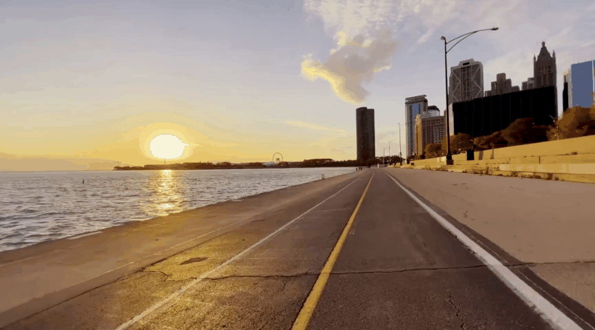
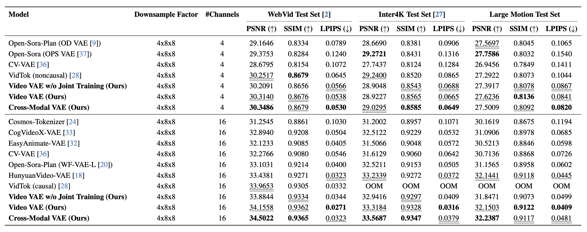

# VideoVAE+: Large Motion Video Autoencoding with Cross-modal Video VAE

| Ground Truth (GT) | Reconstructed |
|-------------------|---------------|
|  |  |
|  |  |
|  |  |
|  |  |
|  |  |

[Yazhou Xing](https://yzxing87.github.io)\*, [Yang Fei](https://sunfly04.github.io)\*, [Yingqing He](https://yingqinghe.github.io)\*&#8224;, [Jingye Chen](https://jingyechen.github.io), [Jiaxin Xie](https://jiaxinxie97.github.io/Jiaxin-Xie), [Xiaowei Chi](https://scholar.google.com/citations?user=Vl1X_-sAAAAJ&hl=zh-CN), [Qifeng Chen](https://cqf.io/)&#8224; (*equal contribution, &#8224;corresponding author)
*The Hong Kong University of Science and Technology*

#### [Project Page](https://yzxing87.github.io/vae/) | [Paper](https://arxiv.org/abs/2412.17805) | [High-Res Demo](https://www.youtube.com/embed/Kb4rn9z9xAA)

A state-of-the-art **Video Variational Autoencoder (VAE)** designed for high-fidelity video reconstruction. This project leverages cross-modal and joint video-image training to enhance reconstruction quality.

---

## ✨ Features

- **High-Fidelity Reconstruction**: Achieve superior image and video reconstruction quality.
- **Cross-Modal Reconstruction**: Utilize captions to guide the reconstruction process.
- **State-of-the-Art Performance**: Set new benchmarks in video reconstruction tasks.


---

## 📰 News
- [Jan 2025] 🏋️ Released training code & better pretrained 4z-text weight
- [Dec 2024] 🚀 Released inference code and pretrained models
- [Dec 2024] 📝 Released paper on [arXiv](https://arxiv.org/abs/2412.17805)
- [Dec 2024] 💡 Project page is live at [VideoVAE+](https://yzxing87.github.io/vae/)

---

## ⏰ Todo

- [x] **Release Pretrained Model Weights**
- [x] **Release Inference Code**
- [x] **Release Training Code**

---

## 🚀 Get Started

Follow these steps to set up your environment and run the code:

### 1. Clone the Repository

```bash
git clone https://github.com/VideoVerses/VideoVAEPlus.git
cd VideoVAEPlus
```

### 2. Set Up the Environment

Create a Conda environment and install dependencies:

```bash
conda create --name vae python=3.10 -y
conda activate vae
pip install -r requirements.txt
```

---

## 📦 Pretrained Models

| Model Name      | Latent Channels | Download Link    |
|-----------------|-----------------|------------------|
| sota-4z         | 4               | [Download](https://drive.google.com/file/d/1WEKBdRFjEUxwcBgX_thckXklD8s6dDTj/view?usp=drive_link) |
| sota-4z-text    | 4               | [Download](https://drive.google.com/file/d/1PWRPn7-D8vqcOH57dmdnipgOe174H9Zs/view?usp=sharing) |
| sota-16z        | 16              | [Download](https://drive.google.com/file/d/13v2Pq6dG1jo7RNImxNOXr9-WizgMiJ7M/view?usp=sharing) |
| sota-16z-text   | 16              | [Download](https://drive.google.com/file/d/1iYCAtmdaOX0V41p0vbt_6g8kRS1EK56p/view?usp=sharing) |

- **Note**: '4z' and '16z' indicate the number of latent channels in the VAE model. Models with 'text' support text guidance.

---

## 📁 Data Preparation

To reconstruct videos and images using our VAE model, organize your data in the following structure:

### Videos

Place your videos and optional captions in the `examples/videos/gt` directory.

#### Directory Structure:

```
examples/videos/
├── gt/
│   ├── video1.mp4
│   ├── video1.txt  # Optional caption
│   ├── video2.mp4
│   ├── video2.txt
│   └── ...
├── recon/
    └── (reconstructed videos will be saved here)
```

- **Captions**: For cross-modal reconstruction, include a `.txt` file with the same name as the video containing its caption.

### Images

Place your images in the `examples/images/gt` directory.

#### Directory Structure:

```
examples/images/
├── gt/
│   ├── image1.jpg
│   ├── image2.png
│   └── ...
├── recon/
    └── (reconstructed images will be saved here)
```

- **Note**: The images dataset does not require captions.

---

## 🔧 Inference

Our video VAE supports both image and video reconstruction.

Please ensure that the `ckpt_path` in all your configuration files is set to the actual path of your checkpoint.

### Video Reconstruction

Run video reconstruction using:

```bash
bash scripts/run_inference_video.sh
```

This is equivalent to:

```bash
python inference_video.py \
    --data_root 'examples/videos/gt' \
    --out_root 'examples/videos/recon' \
    --config_path 'configs/inference/config_16z.yaml' \
    --chunk_size 8 \
    --resolution 720 1280
```

- If the chunk size is too large, you may encounter memory issues. In this case, reduce the `chunk_size` parameter. Ensure the `chunk_size` is divisible by 4.

- To enable cross-modal reconstruction using captions, modify `config_path` to `'configs/config_16z_cap.yaml'` for the 16-channel model with caption guidance.

### Image Reconstruction

Run image reconstruction using:

```bash
bash scripts/run_inference_image.sh
```

This is equivalent to:

```bash
python inference_image.py \
    --data_root 'examples/images/gt' \
    --out_root 'examples/images/recon' \
    --config_path 'configs/inference/config_16z.yaml' \
    --batch_size 1
```

- **Note**: that the batch size is set to 1 because the images in the example folder have varying resolutions. If you have a batch of images with the same resolution, you can increase the batch size to accelerate inference.

---

## 🏋️ Training

### Quick Start

To start training, use the following command:

```bash
bash scripts/run_training.sh config_16z
```

This default command trains the 16-channel model with video reconstruction on a single GPU.

### Configuration Options

You can modify the training configuration by changing the config parameter:

- `config_4z`: 4-channel model
- `config_4z_joint`: 4-channel model trained jointly on both image and video data
- `config_4z_cap`': 4-channel model with text guidance
- `config_16z`: Default 16-channel model
- `config_16z_joint`: 16-channel model trained jointly on both image and video data
- `config_16z_cap`: 16-channel model with text guidance

Note: Do not include the `.yaml` extension when specifying the config.

### Data Preparation

#### Dataset Structure
The training data should be organized in a CSV file with the following format:

```csv
path,text
/absolute/path/to/video1.mp4,A person walking on the beach
/absolute/path/to/video2.mp4,A car driving down the road
```

#### Requirements:
- Use absolute paths for video files
- Include two columns: path and text
- For training without text guidance, leave the caption column empty but maintain the CSV structure

#### Example CSV:
```csv
# With captions
/data/videos/clip1.mp4,A dog playing in the park
/data/videos/clip2.mp4,Sunset over the ocean

# Without captions
/data/videos/clip1.mp4,
/data/videos/clip2.mp4,
```

---

## 📊 Evaluation

Use the provided scripts to evaluate reconstruction quality using **PSNR**, **SSIM**, and **LPIPS** metrics.

### Evaluate Image Reconstruction

```bash
bash scripts/evaluation_image.sh
```

### Evaluate Video Reconstruction

```bash
bash scripts/evaluation_video.sh
```

---

## 📝 License

Please follow [CC-BY-NC-ND](./LICENSE).

## Star History

[](https://star-history.com/#VideoVerses/VideoVAEPlus&Date)
